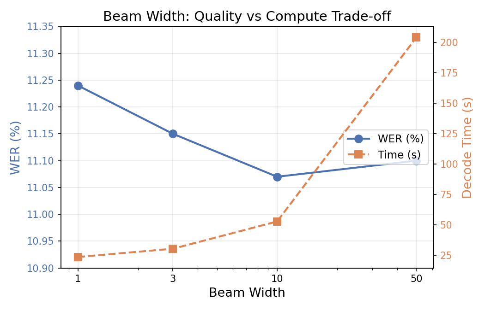
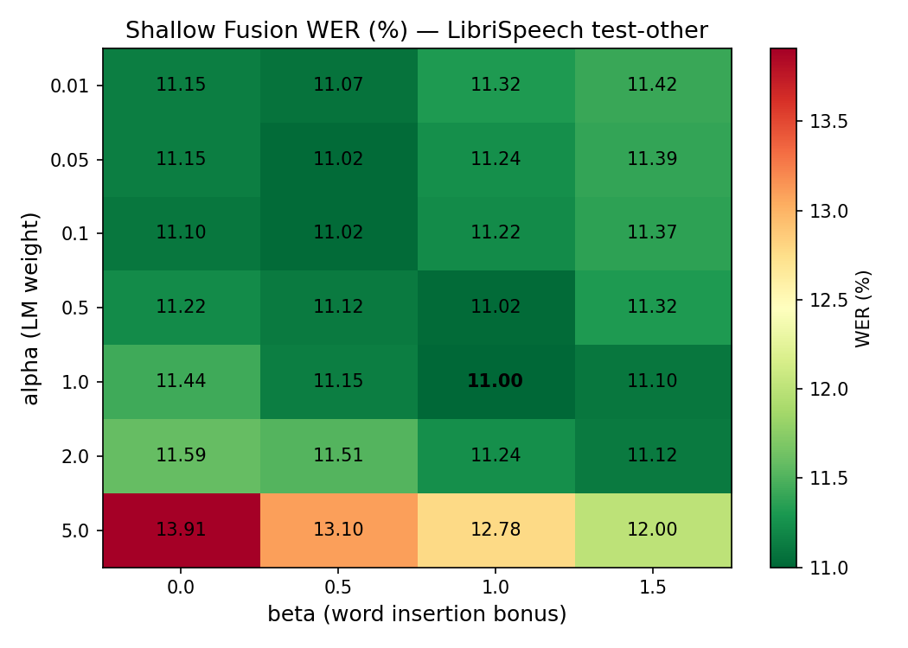
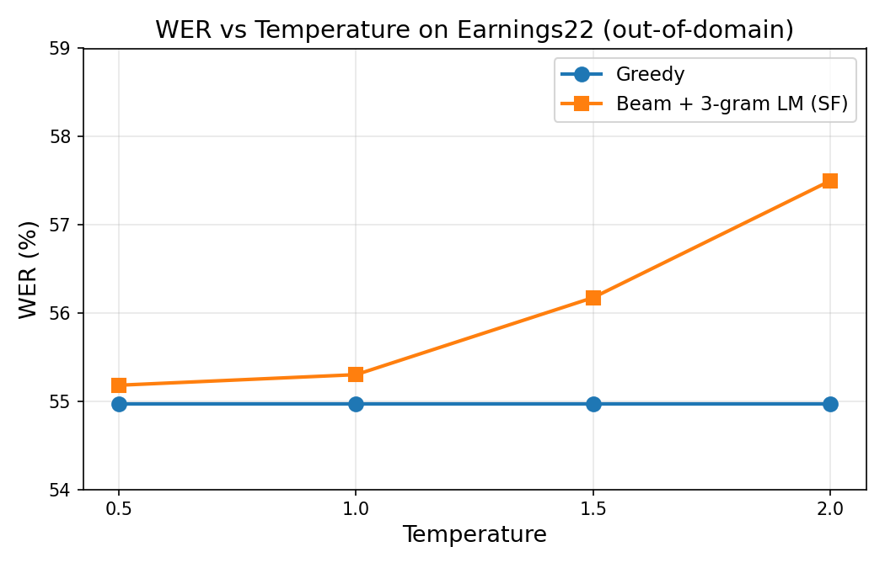
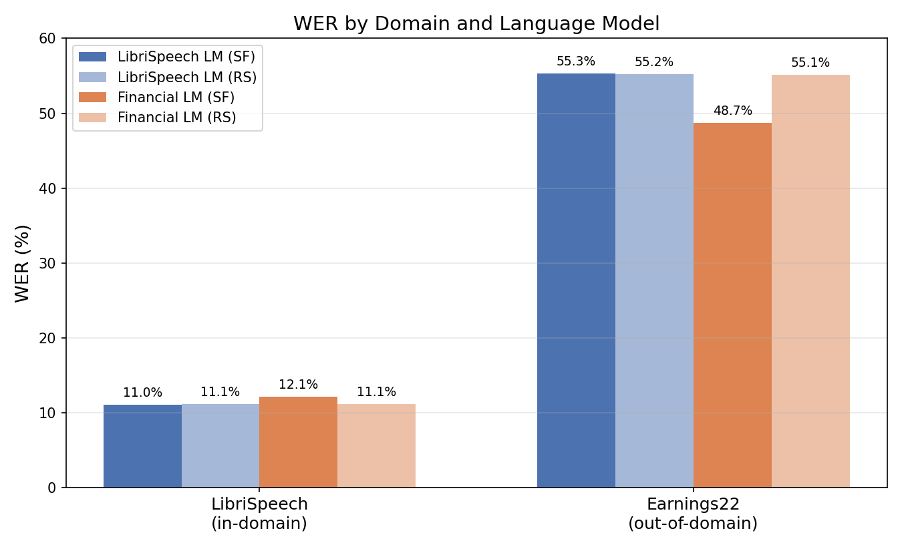

# ASR Decoding Report

## Part 1 — CTC Decoding

### Task 1. Greedy Decoding

Greedy decoding takes the argmax at each time step, collapses repeated tokens, and removes blanks.

**Results (LibriSpeech test-other):** WER = 11.22%, CER = 3.81%

---

### Task 2. Beam Search Decoding

CTC prefix beam search maintains multiple hypotheses, tracking separate blank and non-blank probabilities for each prefix.

| Beam Width | WER    | CER   | Time (s) |
|-----------:|-------:|------:|----------:|
|          1 | 11.24% | 3.80% |      23.6 |
|          3 | 11.15% | 3.78% |      30.4 |
|         10 | 11.07% | 3.77% |      52.8 |
|         50 | 11.10% | 3.77% |     204.2 |



**Analysis:** Beam search improves WER from 11.24% (bw=1, equivalent to greedy) to 11.07% (bw=10). Beyond bw=10, WER plateaus (and even slightly increases at bw=50), while compute time grows roughly linearly. Beam width 10 offers the best quality-to-cost ratio: it captures most of the search benefit at ~2.5x the greedy decoding time. Beam width 50 is 4x slower than bw=10 with no improvement.

---

### Task 3. Temperature Scaling

| T   | WER    | CER   |
|----:|-------:|------:|
| 0.5 | 11.22% | 3.81% |
| 0.8 | 11.22% | 3.81% |
| 1.0 | 11.22% | 3.81% |
| 1.2 | 11.22% | 3.81% |
| 1.5 | 11.22% | 3.81% |
| 2.0 | 11.22% | 3.81% |

**WER is completely flat across all temperatures.** This is expected: greedy decoding takes argmax at each time step. Temperature scales all logits by the same factor (logits/T), which changes the magnitude of probability differences but not the ranking. Since argmax only depends on ranking, the greedy output is identical for any T > 0.

Temperature only has an effect when it interacts with other components that are sensitive to probability magnitudes (e.g., beam search pruning or LM fusion). This is confirmed in Task 7b, where temperature significantly affects Beam+LM decoding on out-of-domain data.

---

## Part 2 — Language Model Integration

## Task 4. Beam Search with Shallow Fusion (3-gram LM)

### Method

Shallow fusion integrates the language model during beam search. At each pruning step, beams are ranked by a combined score:

$$\text{score} = \log p_{\text{acoustic}} + \alpha \cdot \log_{10} p_{\text{LM}} + \beta \cdot N_{\text{words}}$$

The LM scores the full decoded text of each beam candidate (including partial words), which ensures correct pruning even at high alpha. The LM score is computed on-the-fly using KenLM.

### Alpha/Beta Sweep Results (LibriSpeech test-other, beam_width=3)

| alpha \ beta |   0.0 |   0.5 |   1.0 |   1.5 |
|:------------:|------:|------:|------:|------:|
| **0.01**     | 11.15 | 11.07 | 11.32 | 11.42 |
| **0.05**     | 11.15 | 11.02 | 11.24 | 11.39 |
| **0.1**      | 11.10 | 11.02 | 11.22 | 11.37 |
| **0.5**      | 11.22 | 11.12 | 11.02 | 11.32 |
| **1.0**      | 11.44 | 11.15 |**11.00**| 11.10 |
| **2.0**      | 11.59 | 11.51 | 11.24 | 11.12 |
| **5.0**      | 13.91 | 13.10 | 12.78 | 12.00 |

**Best configuration: alpha=1.0, beta=1.0, WER=11.00%, CER=3.76%**



### Analysis

- At very low alpha (0.01–0.05), the LM has minimal influence; WER stays close to the plain beam search baseline (~11.15%).
- At moderate alpha (0.1–1.0), the LM begins to help, but only in combination with a word insertion bonus (beta). The best result requires both alpha=1.0 and beta=1.0 — the beta compensates for the LM's tendency to prefer shorter hypotheses with fewer words.
- At alpha=5.0, the LM completely dominates the acoustic model, causing WER to degrade sharply (up to 13.91%). The acoustic model is already strong in-domain, so excessive LM weight introduces more errors than it corrects.

---

## Task 5. 4-gram vs 3-gram LM

| LM          | WER    | CER   |
|:------------|-------:|------:|
| 3-gram      | 11.00% | 3.76% |
| 4-gram      | 11.07% | 3.77% |

The 4-gram LM performs slightly worse than the pruned 3-gram LM. This is likely because the pruned 3-gram is well-optimized for the LibriSpeech domain, while the larger 4-gram model may introduce noise from less reliable 4-gram statistics. The difference is within noise, suggesting that for this dataset and beam width, a 3-gram context is sufficient.

---

## Task 6. Second-Pass LM Rescoring

### Method

LM rescoring is a two-pass approach:
1. First, beam search generates N-best hypotheses (with acoustic scores only)
2. Then, each hypothesis is re-scored using the combined score formula

This decouples the search space from the LM: beam search explores the space freely, and the LM only re-ranks final candidates.

### Alpha/Beta Sweep Results (LibriSpeech test-other, beam_width=3)

| alpha \ beta |   0.0 |   0.5 |   1.0 |   1.5 |
|:------------:|------:|------:|------:|------:|
| **0.01**     | 11.15 | 11.12 |**11.10**| 11.10 |
| **0.05**     | 11.15 | 11.12 | 11.10 | 11.10 |
| **0.1**      | 11.15 | 11.12 | 11.10 | 11.10 |
| **0.5**      | 11.15 | 11.15 | 11.10 | 11.10 |
| **1.0**      | 11.17 | 11.15 | 11.10 | 11.10 |
| **2.0**      | 11.42 | 11.24 | 11.15 | 11.15 |
| **5.0**      | 11.63 | 11.61 | 11.54 | 11.46 |

**Best configuration: alpha=0.01, beta=1.0, WER=11.10%, CER=3.77%**

### Shallow Fusion vs Rescoring — Stability Comparison

**Rescoring is significantly more stable** to large alpha values than shallow fusion:

| alpha | SF (beta=1.0) | RS (beta=1.0) |
|------:|--------------:|--------------:|
| 0.01  | 11.32%        | 11.10%        |
| 1.0   | 11.00%        | 11.10%        |
| 5.0   | 12.78%        | 11.54%        |

At alpha=5.0, SF degrades by +1.78% absolute, while RS only degrades by +0.44%. This is because rescoring operates on a fixed set of hypotheses produced by the acoustic model alone — the LM can only re-rank, not generate new paths. In contrast, SF allows the LM to influence the search, which at high alpha leads to acoustically implausible paths being explored.

### Qualitative Comparison (beam_width=10)

11 out of 200 samples showed differences between methods:

```
[24] REF:  a fellow who was shut up in prison for life might do it he said
     BEAM: a fellow who as shut up in prison for life might doit he said
     SF:   a fellow who as shut up in prison for life might do it he said ✓
     RS:   a fellow who as shut up in prison for life might do it he said ✓
```
Both LM methods correctly split "doit" → "do it" (common word boundary error).

```
[33] REF:  and why did andy call mister gurr father
     BEAM: and why did andy call mister gurfather
     SF:   and why did andy call mister gur father ✓
     RS:   and why did andy call mister gur father ✓
```
Both methods fix the word boundary ("gurfather" → "gur father"), though the spelling error in "gurr" → "gur" remains (character-level error, not fixable by word-level LM).

```
[153] REF:  ... and after a little the rest of my fellows perished ...
      BEAM: ... and after little the rest of my fellows perished ...
      SF:   ... and after a little the rest of my fellows perished ...  ✓
      RS:   ... and after little the rest of my fellows perished ...
```
SF restores the missing word "a", while RS does not (because "a" was not in any beam hypothesis).

```
[14] REF:  the kick he had received was a foretaste ...
     BEAM: the kickhe had received was a foretaste ...
     RS:   the kickhe had received was a fore taste ...  ✗
```
RS introduced an error by splitting "foretaste" → "fore taste" (LM prefers more common words).

### Patterns Observed

**What the LM fixes:**
- Word boundary errors (merged words like "doit" → "do it", "gurfather" → "gur father")
- Missing function words ("after little" → "after a little")

**What the LM fails to fix or makes worse:**
- Character-level errors ("alkward" instead of "awkward") — the LM operates at word level
- Rare/archaic words ("belike", "aboade") — not in the LM vocabulary
- Over-splitting: sometimes breaks correct compound words ("foretaste" → "fore taste")

**SF vs RS disagreements:** SF can insert words not present in any beam hypothesis (e.g., restoring "a" in sample 153), while RS is limited to re-ranking existing hypotheses. This makes SF more powerful but also more prone to introducing novel errors.

---

## Task 7. Cross-Domain Evaluation

| Method                    | LibriSpeech WER | LibriSpeech CER | Earnings22 WER | Earnings22 CER |
|:--------------------------|----------------:|----------------:|---------------:|---------------:|
| Greedy                    |          11.22% |           3.81% |         54.97% |         25.58% |
| Beam search (bw=10)       |          11.07% |           3.77% |         54.94% |         25.38% |
| Beam + 3-gram SF          |          11.00% |           3.75% |         55.30% |         25.41% |
| Beam + 3-gram RS          |          11.10% |           3.76% |         55.21% |         25.38% |

### Analysis

The gap between in-domain and out-of-domain performance is enormous: ~11% WER on LibriSpeech vs ~55% WER on Earnings22. This is expected because:
1. **Acoustic domain mismatch**: The wav2vec2 model was trained on LibriSpeech (clean audiobook speech). Earnings calls have noise, crosstalk, varied accents, and telephony artifacts.
2. **Vocabulary mismatch**: Financial terms (ticker symbols, accounting terms, company names) are absent from the training data.

**The LibriSpeech LM provides no benefit (and slightly hurts) on Earnings22:** SF goes from 54.94% → 55.30% WER. This is because the LM learned the statistical patterns of literary text, not financial speech. It actively biases the decoder toward literary word sequences, pushing predictions away from the correct financial terminology.

---

## Task 7b. Temperature Scaling on Out-of-Domain Data

| T   | Greedy WER | Beam+LM WER |
|----:|-----------:|------------:|
| 0.5 |     54.97% |      55.18% |
| 1.0 |     54.97% |      55.30% |
| 1.5 |     54.97% |      56.17% |
| 2.0 |     54.97% |      57.50% |



### Analysis

**Greedy decoding is completely flat** across all temperatures. This is because greedy takes argmax at each step — scaling logits by a constant factor doesn't change which index has the highest value. Temperature only affects the magnitude of probability differences, not the ranking.

**Beam+LM gets progressively worse as T increases** (55.18% → 57.50%). Higher temperature flattens the acoustic distribution, giving the (wrong-domain) LM more relative influence. Since the LibriSpeech LM actively hurts on financial speech, amplifying its influence makes things worse.

This contrasts with the in-domain case (LibriSpeech, Task 3) where temperature changes have minimal effect on greedy decoding. On Earnings22, the acoustic model was never trained on financial speech, so its outputs are already poorly calibrated. Flattening them further (T > 1) only compounds the problem by handing more control to a mismatched LM.

**Key insight:** Higher temperature can theoretically help LM fusion if the LM is well-matched to the domain, by softening overconfident acoustic predictions. But when the LM is mismatched, higher T amplifies the damage.

---

## Task 8. Financial-Domain LM Training

A 3-gram KenLM model was trained on the Earnings22 training corpus (`data/earnings22_train/corpus.txt`, ~5000 lines, ~100k words) using:

```bash
lmplz -o 3 --discount_fallback < data/earnings22_train/corpus.txt > financial-3gram.arpa
```

Model statistics: 5701 unigrams, 42688 bigrams, 77164 trigrams.

---

## Task 9. Domain-Specific LM Comparison

| LM / Dataset        | SF WER | SF CER | RS WER | RS CER |
|:---------------------|-------:|-------:|-------:|-------:|
| **LibriSpeech 3-gram** |        |        |        |        |
| — LibriSpeech        | 11.00% |  3.75% | 11.10% |  3.76% |
| — Earnings22         | 55.30% | 25.41% | 55.21% | 25.38% |
| **Financial 3-gram**  |        |        |        |        |
| — LibriSpeech        | 12.10% |  3.89% | 11.10% |  3.76% |
| — Earnings22         |**48.70%**| 24.78%| 55.12% | 25.37% |



### Analysis

**Domain-matched LM dramatically helps out-of-domain:** The financial 3-gram LM reduces Earnings22 WER from 55.30% → **48.70%** with shallow fusion — an absolute improvement of **6.6% WER**. This demonstrates the power of domain adaptation: even a small corpus (~100k words) provides enormous benefit when matched to the target domain.

**Financial LM hurts in-domain:** On LibriSpeech, the financial LM degrades SF WER from 11.00% → 12.10%, as expected. Financial vocabulary and n-gram statistics don't match literary text.

**Rescoring is robust to LM mismatch:** RS with the financial LM gives 55.12% on Earnings22 — almost no change from the LibriSpeech LM (55.21%). This confirms that rescoring is conservative: it can only re-rank existing hypotheses, so a mismatched LM has limited downside, but also limited upside. The financial LM only helps when integrated during search (SF), where it can steer the decoder toward correct financial terms.

### Which LM works best?
- **In-domain (LibriSpeech):** LibriSpeech 3-gram (11.00% SF). Domain match matters.
- **Out-of-domain (Earnings22):** Financial 3-gram (48.70% SF). Domain-matched LM helps far more than a larger general LM.

**Does domain-matched LM help more than a larger general LM?** Definitively yes. The financial 3-gram is trained on only ~100k words yet outperforms the LibriSpeech 3-gram (trained on millions of words) by 6.6% WER on financial speech. This confirms that **domain relevance > data quantity** for language model effectiveness in ASR.
